# 달빛수원 서비스 플로우 기획 문서

**문서 목적:** 달빛수원 MVP의 사용자 흐름, 데이터 흐름, 운영 흐름을 별도 관리 가능한 서비스 플로우 문서로 정리한다.  
**문서 상태:** Approved Flow v1  
**작성일:** 2026-05-25  
**연계 문서:** [달빛수원 MVP 기획 문서](/Users/nunu/Desktop/10-19%20개발/15%20공모전/docs/superpowers/specs/2026-05-25-dalbit-suwon-mvp-design.md), [달빛수원 앱팀/웹팀 역할 분담 문서](/Users/nunu/Desktop/10-19%20개발/15%20공모전/docs/superpowers/specs/2026-05-25-dalbit-suwon-team-responsibilities.md)

---

## 1. 문서 범위

이 문서는 다음 4가지 흐름을 다룬다.

- 사용자 앱 서비스 흐름
- 공개 웹 유입 및 앱 전환 흐름
- 공공데이터 수집 및 Supabase 적재 흐름
- 운영 웹 편집 및 서비스 반영 흐름

## 2. 서비스 구조 한눈에 보기

달빛수원은 `Flutter 사용자 앱`, `Next.js 공개 웹`, `Next.js 운영 웹`, `Supabase 백엔드`로 구성된다.  
공공데이터는 앱과 웹이 직접 호출하지 않고, Supabase를 단일 서비스 데이터 소스로 사용한다.

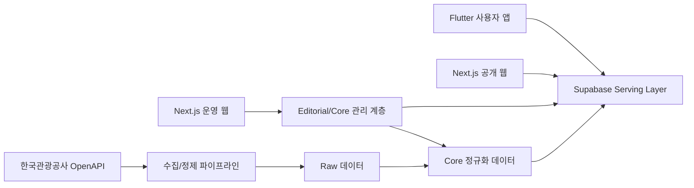

## 3. 사용자 앱 서비스 플로우

### 3.1 핵심 원칙

- 사용자는 비회원으로도 바로 진입한다.
- 홈에서 추천 코스를 먼저 고른다.
- 길찾기는 외부 지도 앱으로 넘긴다.
- 미션 완료는 `자동 위치 인식 우선`, `수동 체크 보조` 구조를 쓴다.

### 3.2 사용자 메인 플로우

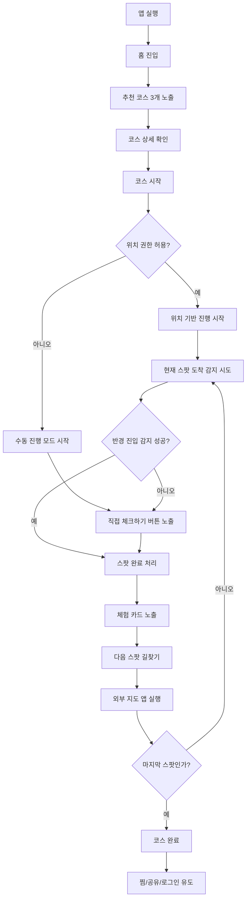

### 3.3 사용자 세부 흐름

#### 홈

- 시간대에 맞는 추천 코스 노출
- 포토스팟/내 주변/로컬 추천 섹션 제공
- 로그인 없이 탐색 가능

#### 코스 상세

- 소요시간, 거리, 스팟 수, 추천 시간대 표시
- 코스 내 스팟 순서 확인
- `코스 시작` CTA 제공

#### 코스 진행

- 현재 스팟
- 다음 스팟
- 진행률
- 도착 체크 상태
- 외부 길찾기 버튼

#### 코스 완료

- 코스 완료 피드백
- 찜 저장
- 공유
- 로그인 유도

## 4. 공개 웹 서비스 플로우

### 4.1 역할

공개 웹은 서비스 본체가 아니라 `검색 유입`, `공유 링크 랜딩`, `앱 열기/설치 유도` 채널이다.

### 4.2 공개 웹 플로우

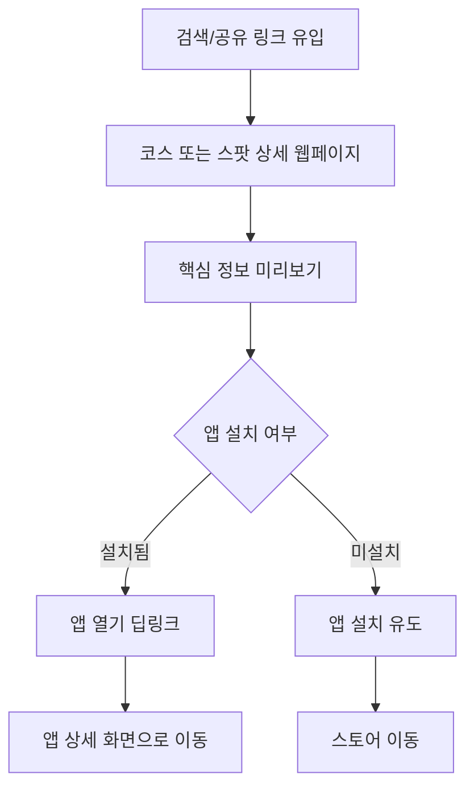

### 4.3 공개 웹에서 하지 않는 일

- 코스 진행 상태 저장
- 위치 자동 체크
- 실사용 미션 진행
- 사용자 장기 기록 관리

## 5. 공공데이터 수집/정제 플로우

### 5.1 원칙

- Flutter 앱과 Next.js 웹은 공공 API를 직접 호출하지 않는다.
- 공공 API 원본은 먼저 Supabase `raw` 계층에 저장한다.
- 서비스에 필요한 필드만 정규화해 `core` 계층으로 변환한다.
- 자체 기획 문구는 `editorial` 계층에서 합성한다.
- 앱/웹은 `serving` 계층만 읽는다.

### 5.2 데이터 파이프라인 플로우

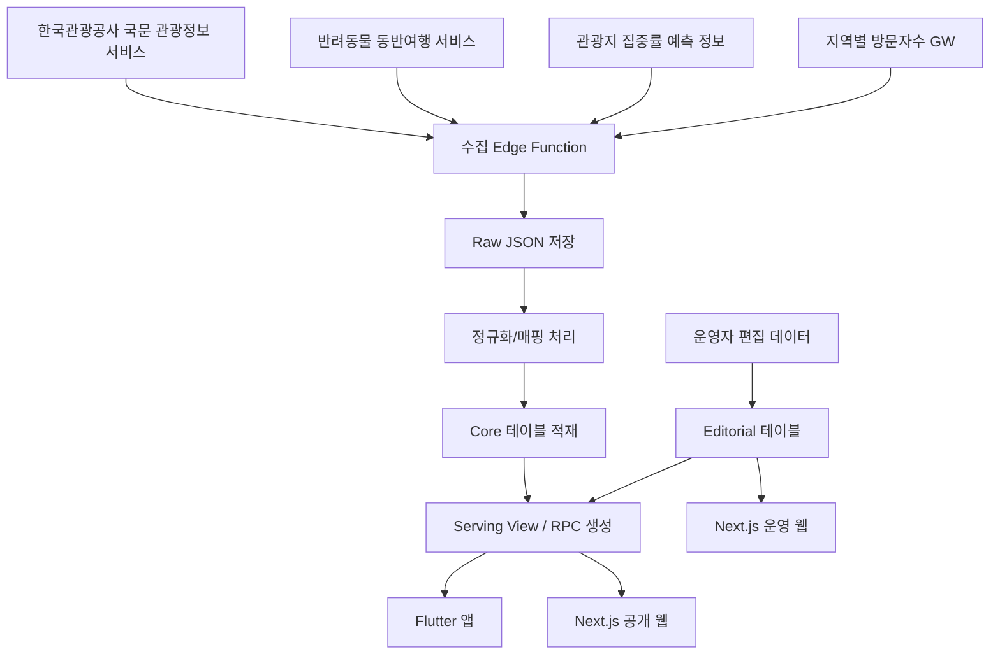

### 5.3 수집 대상별 처리 방식

#### 관광 기본 정보

- 관광지명
- 좌표
- 주소
- 이미지
- 개요

처리 방식:

- 원본 JSON 보존
- 서비스 노출 필드로 정규화
- 대표 이미지와 썸네일 분리

#### 반려동물 정보

- 동반 가능 여부
- 유의사항
- 이용 가능 시설

처리 방식:

- 원문 보존
- `allowed/partial/restricted/unknown` 상태값 정규화
- 사용자용 짧은 문구와 운영용 원문 분리

#### 혼잡도 예측

- 향후 30일 집중률

처리 방식:

- 원본 점수 저장
- `여유/보통/혼잡` 등급 변환
- 대체 스팟 추천 로직과 연결

#### 지역 방문자수

- 지역 단위 방문량

처리 방식:

- 운영 지표/기획 참고용 저장
- 사용자 실시간 카드 노출보다는 관리자 분석용 활용

## 6. Supabase 서빙 플로우

### 6.1 서빙 계층 원칙

- 앱과 웹은 raw/core/editorial을 직접 읽지 않는다.
- 읽기 전용 서비스 데이터는 `serving view` 또는 `RPC`로 제공한다.
- 복합 비즈니스 로직은 `Edge Function`에서 처리한다.

### 6.2 앱/웹 서빙 플로우

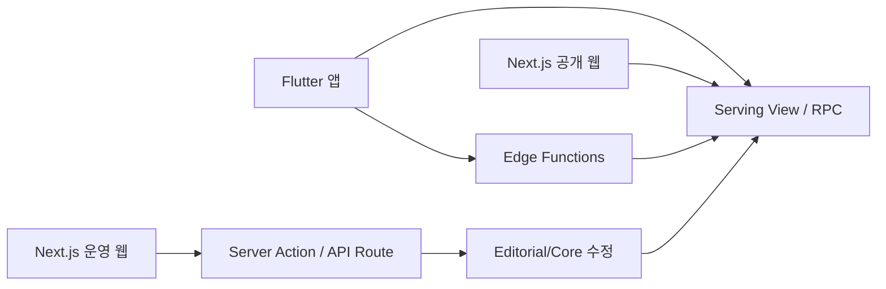

### 6.3 권장 읽기/쓰기 분리

#### 읽기

- 홈 피드
- 코스 상세
- 스팟 상세
- 내 주변 스팟
- 로컬 추천

#### 쓰기 또는 로직 처리

- 코스 시작
- 체크인 판정
- 진행률 갱신
- 운영자 수동 재동기화

## 7. 운영 웹 편집 플로우

### 7.1 운영 웹 역할

- 코스 생성/수정
- 스팟 노출 여부 관리
- 미션 문구 편집
- 포토 팁 편집
- 로컬 추천 링크 편집
- 반려동물 메타데이터 보강

### 7.2 운영 플로우

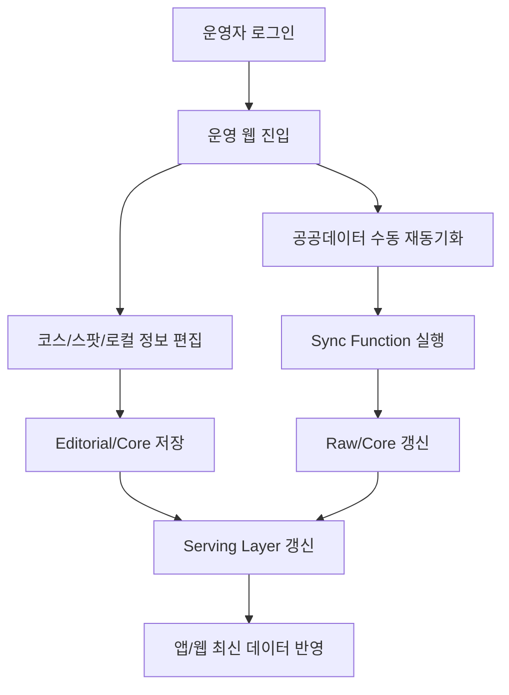

## 8. 정기 동기화 플로우

### 8.1 동기화 전략

- **GitHub Actions**가 정해진 시간에 Edge Function을 HTTP 호출한다. Supabase Cron(pg_cron)은 Pro 플랜 이상 필요로 MVP에서는 사용하지 않는다.
- `workflow_dispatch`를 함께 설정해 운영자가 수동으로 즉시 재동기화할 수 있도록 한다.
- Edge Function이 한국관광공사 API를 호출한다.
- 정규화 -> 서빙 갱신 순서로 처리한다.

### 8.2 정기 동기화 플로우

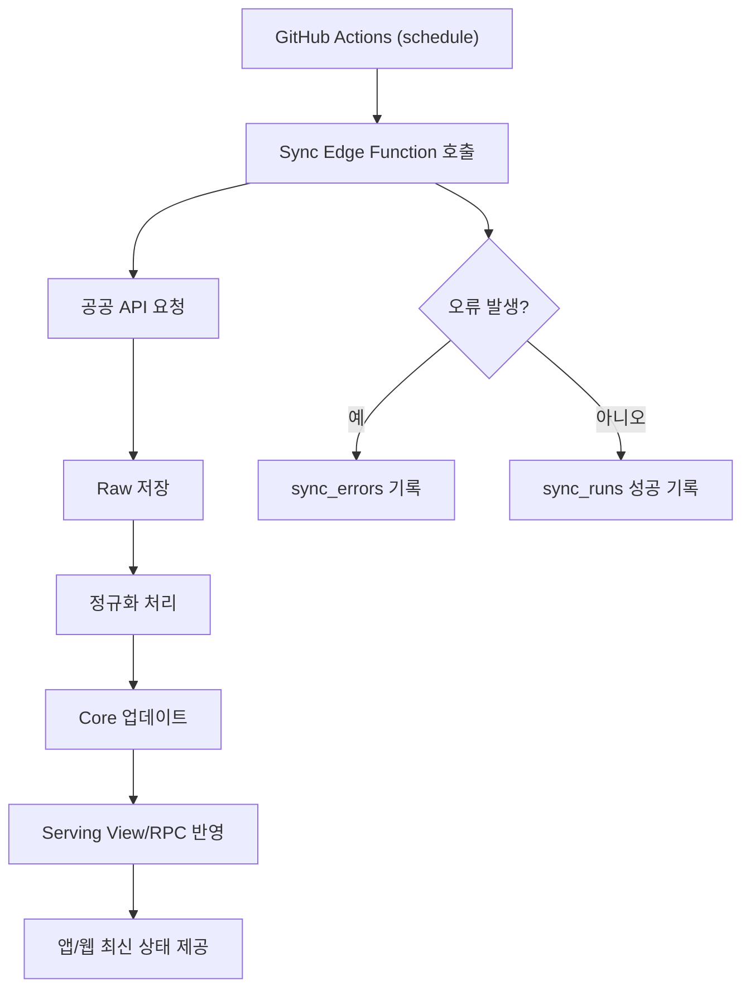

## 9. 서비스 플로우에서 바로 확정할 운영 원칙

- 공공데이터는 직접 클라이언트 호출 금지
- Supabase를 단일 서비스 데이터 소스로 사용
- 사용자 앱은 진행 경험 담당
- 공개 웹은 유입과 앱 전환 담당
- 운영 웹은 콘텐츠 수정과 데이터 운영 담당
- 자동 체크 실패 시 항상 수동 체크 가능
- 반려동물 기능은 MVP 비노출이지만 데이터 구조는 선반영

## 10. 실무 적용 체크리스트

### 10.1 앱 팀

- 코스 시작 플로우 확정
- 체크인 상태머신 정의
- 외부 지도 딥링크 표준화
- 비회원/로그인 경계 정의

### 10.2 웹 팀

- 코스/스팟 공개 URL 체계 확정
- 앱 열기/설치 유도 CTA 위치 고정
- SEO 메타데이터 설계

### 10.3 백엔드 팀

- raw/core/editorial/serving 계층 분리
- RLS 정책 설계
- Cron 잡과 Edge Function 정의
- sync error 로깅 구조 설계

### 10.4 운영 팀

- 초기 코스 3개 확정
- 핵심 스팟 8~10개 확정
- 야간 포인트/포토 팁/미션 문구 작성
- 반려동물 메타데이터 보강 기준 작성

## 11. 2인 팀 기준 Supabase 구현 흐름

### 11.1 전제

현재 구조가 `웹 1명 + 앱 1명`이고 별도 백엔드 팀이 없다면, 별도 Node 백엔드를 새로 두지 않는 것이 맞다.  
이 프로젝트에서는 Supabase를 사실상 `관리형 백엔드`로 사용한다.

핵심은 아래 3개만 구분해서 쓰는 것이다.

- `View`
  - 읽기 전용 화면 데이터 조합
- `RPC`
  - 파라미터가 있는 DB 로직
- `Edge Function`
  - 외부 API 호출, 비밀키 필요 작업, Cron 작업

### 11.2 무엇을 어디서 처리할지

#### View로 처리할 것

- 홈에서 보여줄 공개 코스 목록
- 스팟 상세에 필요한 읽기 전용 조합 데이터
- 공개 웹에서 읽는 코스/스팟 상세

#### RPC로 처리할 것

- 코스 상세 단건 조합
- 현재 위치 기준 인근 스팟 계산
- 체크인 판정 및 진행률 갱신

#### 직접 INSERT로 처리할 것

- 코스 시작 (`core.user_course_progress` 직접 INSERT — RPC 불필요)

#### Edge Function으로 처리할 것

- 한국관광공사 공공데이터 수집
- 반려동물 데이터 수집
- 혼잡도 데이터 수집
- 운영자 수동 재동기화
- Cron에서 정기 호출되는 잡

### 11.3 가장 단순한 권장 아키텍처

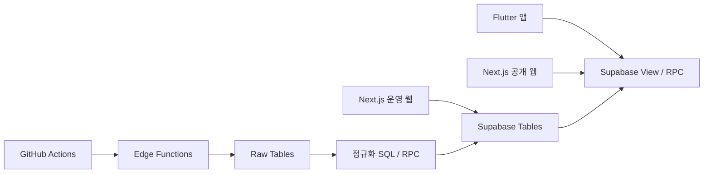

### 11.4 실제 요청 흐름

#### 1. 앱 홈 진입

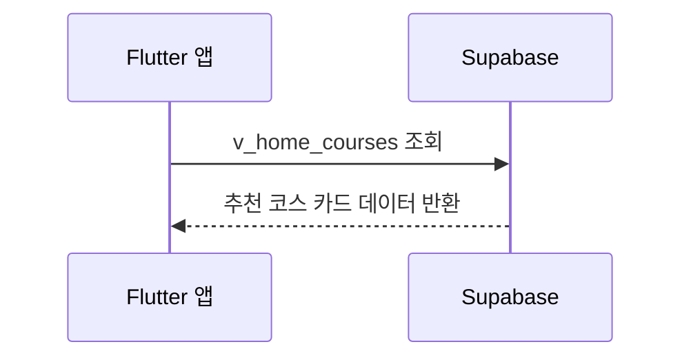

#### 2. 코스 상세 조회

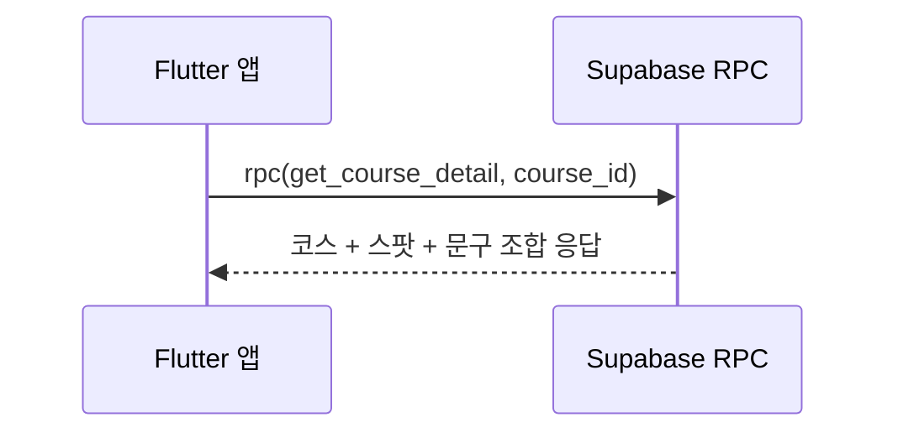

#### 3. 코스 시작

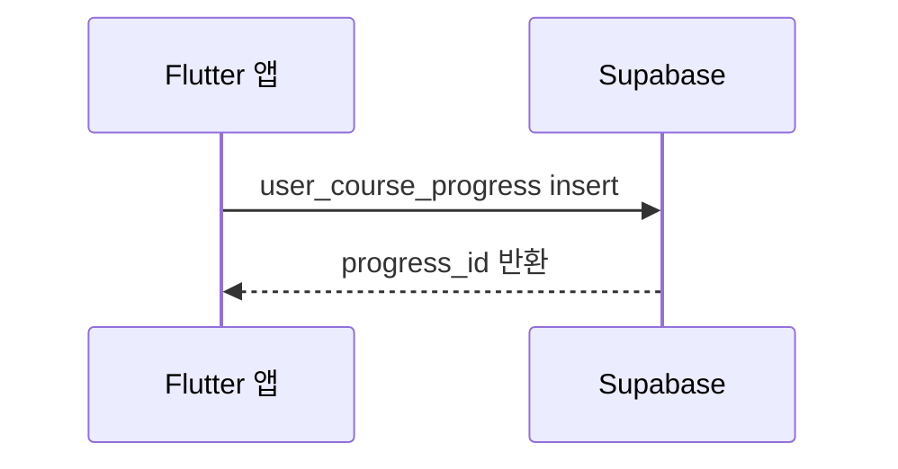

#### 4. 스팟 체크인

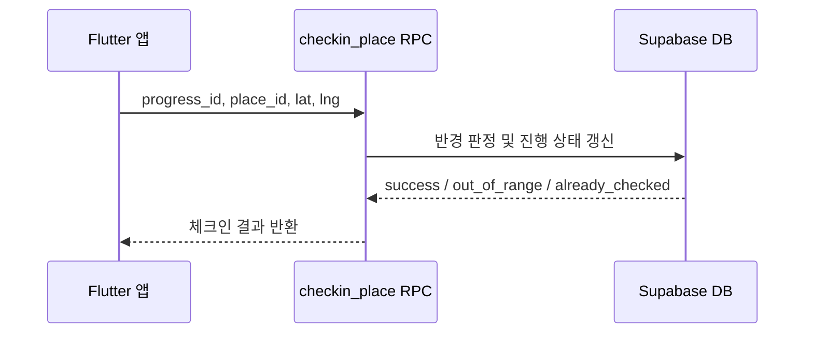

#### 5. 공공데이터 동기화

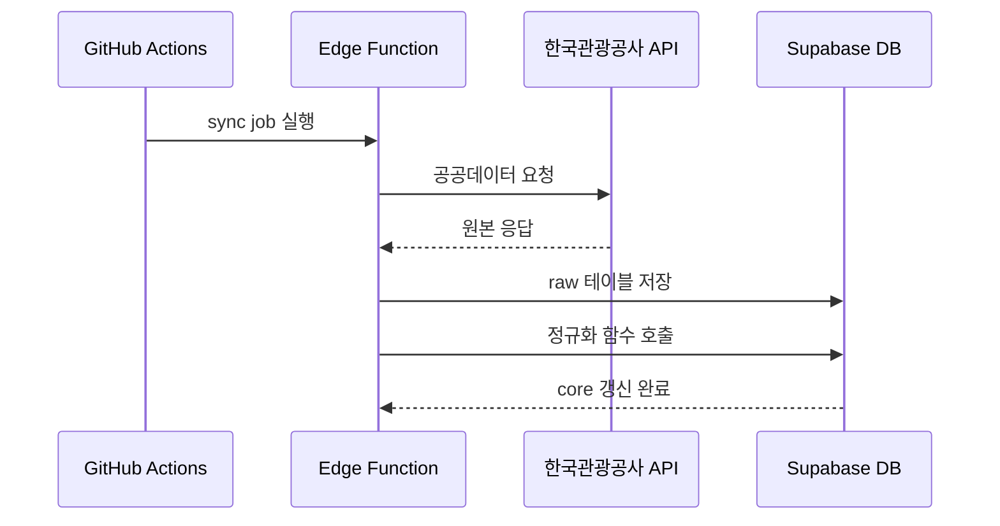

## 12. 2인 팀 기준 최소 구현 범위

### 12.1 처음부터 만들 테이블

**Phase 1 (MVP):**
- `core.places`
- `core.place_images`
- `core.place_pet_policies`
- `core.courses`
- `core.course_places`
- `editorial.place_copy`
- `editorial.course_copy`
- `core.user_course_progress`
- `core.user_place_checkins`

**Phase 2 (출시 이후 — 공공데이터 파이프라인 구축 시):**
- `raw.kto_kor_content`
- `raw.kto_pet_tour`
- `raw.kto_crowd_forecast`
- `core.place_crowd_forecasts`

### 12.2 처음부터 만들 View

- `serving.v_home_courses`
- `serving.v_place_detail`

초기에는 View를 많이 만들 필요 없다.  
읽기 화면이 안정되면 그때 `v_course_detail`을 View로 둘지 RPC로 둘지 결정해도 된다.

### 12.3 처음부터 만들 RPC

- `get_course_detail(course_id)`
- `get_nearby_places(lat, lng, radius_m)`
- `checkin_place(progress_id, place_id, lat, lng, mode)`

`mode`는 `auto` 또는 `manual` 정도로 두면 된다.

### 12.4 처음부터 만들 Edge Function

**Phase 1 (MVP):**
- `sync-kto-content`
- `sync-kto-pet`
- `admin-resync`

**Phase 2 (출시 이후):**
- `sync-kto-crowd` (`core.place_crowd_forecasts` 구현 후 추가)

백엔드 팀이 없으므로 Edge Function 개수를 최소로 유지한다.

## 13. 실제 운영에서의 역할 분담

### 13.1 웹 담당

웹 담당이 아래를 같이 맡는 것이 가장 현실적이다.

- Next.js 공개 웹
- Next.js 운영 웹
- Supabase SQL View
- Supabase RPC
- Supabase Edge Function
- Cron 설정

이유는 운영 웹과 Edge Function이 모두 TypeScript 중심으로 묶이기 때문이다.

### 13.2 앱 담당

앱 담당은 아래를 중심으로 맡는다.

- Flutter 앱 구조
- Supabase Auth 연동
- 홈/코스/스팟/진행 화면
- 위치 권한 및 체크인 UX
- 외부 지도 딥링크

### 13.3 같이 결정할 것

- 응답 JSON 스키마
- 체크인 판정 규칙
- 비회원/로그인 사용자 정책
- 공개 여부와 운영 CMS 필드

## 14. View / RPC / Edge Function을 쉽게 이해하는 기준

### 14.1 View

`테이블 여러 개를 합쳐서 읽기 쉽게 만든 가상 테이블`

예시:

- 홈 코스 카드 목록
- 공개 스팟 상세 페이지용 데이터

### 14.2 RPC

`DB 함수인데 API처럼 호출하는 것`

예시:

- course_id를 넣으면 코스 상세 전체를 조합해 반환
- 현재 좌표를 넣으면 인근 스팟을 계산해 반환
- checkin 요청을 받으면 반경 계산 후 진행 상태를 업데이트

### 14.3 Edge Function

`DB 바깥일을 하는 서버 함수`

예시:

- 외부 공공 API 호출
- 비밀키를 사용한 작업
- Cron으로 자동 실행되는 수집기

## 15. 2인 팀에게 맞는 최종 권장안

### 15.1 하지 말아야 할 것

- 별도 Express/Nest 백엔드 추가
- 모든 화면마다 Edge Function 만들기
- Flutter와 Next.js에 같은 데이터 가공 로직을 중복 구현
- 공공데이터를 앱과 웹에서 직접 호출

### 15.2 이렇게 가면 된다

1. 공공데이터는 Edge Function으로 수집한다.
2. 원본은 raw에 저장한다.
3. 정규화는 SQL/RPC로 처리한다.
4. 앱/웹 읽기는 View/RPC로 처리한다.
5. 운영 웹은 서버 권한으로 편집한다.
6. Flutter는 화면과 UX에 집중하고, Next.js는 운영/공개 웹과 Supabase 로직을 맡는다.

이 문서는 달빛수원 MVP의 서비스 플로우 기준 문서이며, IA, API 설계, DB 설계, 운영 도구 설계의 참조 문서로 사용한다.
